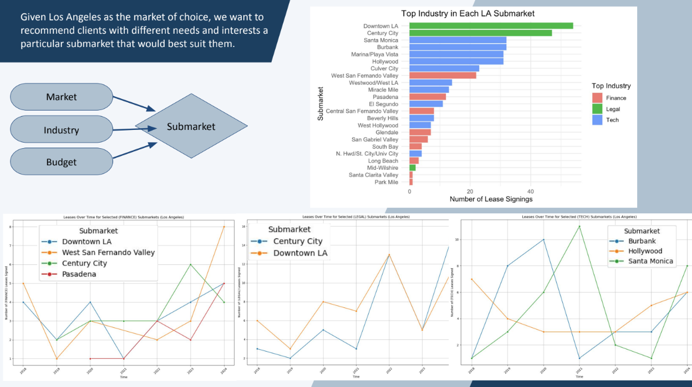
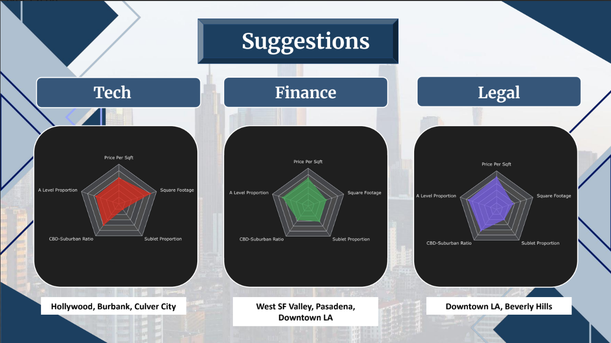

I participated in the 2025 UCLA Datafest, hosted by the American Statistical Association, with a team comprising of Rohan Bodla, Jordan Kikuta, Celine Nugroho, Ethan Xiao, and myself. The provided data set consisted of commercial leasing data within the past decade, and we were tasked with finding trends within the data. My team decided to narrow in on the LA submarket.

LA's top 3 industries are tech, legal, and finance. Our findings revealed that tech companies prefer larger spaces and proximity to the central business district (CBD). Legal and finance companies look for smaller spaces, but prefer the best quality. Finance companies prefer suburban areas, while legal companies prefer being close to the city. Finance companies also have a higher rate of subletting.

We are grateful to have received the Don Ylvisaker Best Insight award. 

