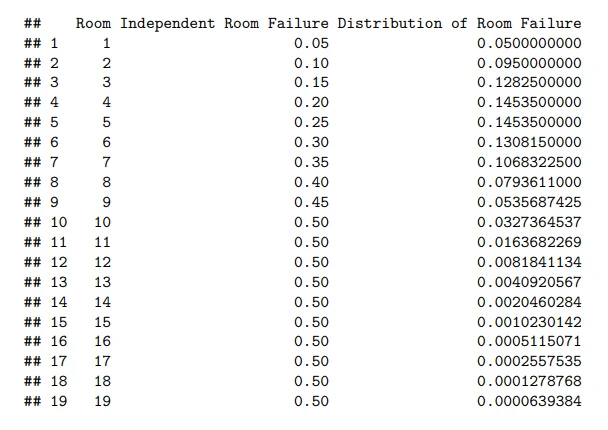
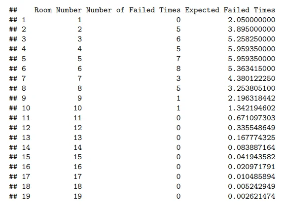

"Millionaire's Race" was a Roblox minigame where a player is shown two doors: proceed with a reward, or take the 5% chance of leaving without anything. The 5% chance would increase by 5% every door until it reached 50. The grand prize could be achieved by passing 20 doors. I was curious if the probability shown was fake or real. 

This project was not about the cumulative probability of success at each room, which several other users had posted. The cumulative probability of success can be phrased as, "What is the probability we succeed this room AND have succeeded all rooms prior?" This is done by choosing a room and multiplying all the success probabilities before the chosen room and the current room's success probability. Room 3, for example: 0.95 * 0.90 * 0.85 = 0.72675.

Instead, I calculated the distribution of failures, which can be phrased as, "What is the probability we succeed all prior rooms, but fail at this one?" This isn't the opposite of the cumulative probability of success. Using our Room 3 example, there's around a 73% chance of getting past this room, but which room you ultimately fail at is uncertain. The distribution of failures fixes this problem by giving a definitive end to each scenario, creating a distribution.

To calculate these probabilities, you take the success probability of the room prior to your final room, then multiply the failure probability to it. For failure at Room 4: 0.72675 (you get past Room 3) * 0.20 = 0.14535. Since all possibilities are accounted for in our distribution, we can say that 14.535% of all runs will end at Room 4. Important note: this entire distribution is based on if the player "risks it" until failure.

The most common rooms to fail at are Room 4 and 5. Approximately 0.1% of all runs will make it past Room 15. Unwritten is the probability of making it to Room 20, which is the same as failing at 19. Room 19 is the final room in our table because I assume there is no pass/fail in Room 20.

I "risked it" to failure for 41 runs, taking note of which room I failed at.

I ran a chi-squared goodness of fit test comparing our observed values to our expected values. We ended up with a chi-squared value of 7.5521. Using 40 degrees of freedom (41 - 1), our ultimate p-value is... 1.

Meaning, it is extremely likely for my 41 observed values to happen under the probabilities given, and we were very, very far off of proving it wrong. Specifically, we needed a chi-squared value of close to 56, or a p-value of 0.05 or under. The samples needed to be way more extreme. Millionaire Race is not a scam.